# SPA 網頁小工具使用者操作手冊

本專案提供十一個可在瀏覽器中直接使用的單頁網頁工具，涵蓋 AI Agent YAML 狀態與交接檔、專案排程、臺灣 LCR／NSFR 試算、銀行信用風險與資本適足情境試算、Markdown 卡片簡報，以及 SQL 目錄、比對、格式化、個資清除與欄位血緣分析。工具不需要本專案專用後端；請依需求開啟對應的 HTML 入口。

## 目錄

- [快速開始](#快速開始)
- [整體使用流程](#整體使用流程)
- [工具總覽](#工具總覽)
- [Agent YAML Maker](#agent-yaml-maker)
- [動態甘特圖與專案倒數看板](#動態甘特圖與專案倒數看板)
- [臺灣 LCR Mapping 與試算](#臺灣-lcr-mapping-與試算)
- [臺灣 NSFR 淨穩定資金比率與試算](#臺灣-nsfr-淨穩定資金比率與試算)
- [銀行信用風險與資本適足模擬器](#銀行信用風險與資本適足模擬器)
- [SQL Catalog](#sql-catalog)
- [Oracle SQL Compare](#oracle-sql-compare)
- [Oracle SQL Formatter Studio](#oracle-sql-formatter-studio)
- [SQL／TXT 個資掃描與清除](#sqltxt-個資掃描與清除)
- [SQL Column Lineage Analyzer](#sql-column-lineage-analyzer)
- [Markdown 卡片簡報工具 (Card Presenter)](#markdown-卡片簡報工具-card-presenter)
- [資料保存、匯出與隱私](#資料保存匯出與隱私)
- [技術棧與離線範圍](#技術棧與離線範圍)
- [常見問題](#常見問題)
- [維護者驗證](#維護者驗證)

## 快速開始

1. 下載或複製本專案。
2. 在檔案總管中開啟下列任一入口：
   - [`agent-yaml-maker/index.html`](./agent-yaml-maker/index.html)
   - [`project-manage-calc/dynamic_gantt_project_countdown.html`](./project-manage-calc/dynamic_gantt_project_countdown.html)
   - [`lcr-mapping-calc/LCR_Mapping_SPA.html`](./lcr-mapping-calc/LCR_Mapping_SPA.html)
   - [`nsfr-mapping-calc/NSFR_Mapping_SPA.html`](./nsfr-mapping-calc/NSFR_Mapping_SPA.html)
   - [`basel-creditrisk-calc/bank_credit_risk_capital_adequacy_simulator.html`](./basel-creditrisk-calc/bank_credit_risk_capital_adequacy_simulator.html)
   - [`sql-mangage/SQL_Catalog.html`](./sql-mangage/SQL_Catalog.html)
   - [`sql-mangage/sql-compare.html`](./sql-mangage/sql-compare.html)
   - [`sql-mangage/OracleSqlFormatter.html`](./sql-mangage/OracleSqlFormatter.html)
   - [`sql-mangage/sql-pii-cleaner.html`](./sql-mangage/sql-pii-cleaner.html)
   - [`sql-mangage/SQL_Column_Lineage_Analyzer.html`](./sql-mangage/SQL_Column_Lineage_Analyzer.html)
   - [`ppt-present/markdown_card_presenter.html`](./ppt-present/markdown_card_presenter.html)
3. 使用瀏覽器頁面中的表單、按鈕與分頁完成操作。

本專案沒有建置或打包步驟，也沒有根目錄 `package.json`。若瀏覽器限制 `file://` 頁面的部分功能，可在專案根目錄啟動任一靜態檔案伺服器，例如：

```powershell
python -m http.server 8080
```

再開啟 `http://localhost:8080/`，並進入上述子目錄。Agent YAML Maker、甘特圖、銀行信用風險模擬器與 Markdown 卡片簡報工具會從 CDN 載入部分樣式或函式庫；若要完整使用，首次開啟時請保持網路連線。LCR、NSFR 工具與 SQL Catalog 不依賴外部函式庫，可直接離線開啟；SQL Catalog 的「選擇目錄」功能建議使用 Chrome 或 Edge。

本專案的「免建置」不等於每個頁面都能在完全斷網下完整使用：Agent YAML Maker 需要從 CDN 載入 Tailwind CSS、js-yaml 與 JSZip，甘特圖與 Markdown 卡片簡報工具需要從 CDN 載入 Tailwind CSS。若這些資源尚未載入，頁面可能缺少樣式或部分功能；請改用可連線的環境，或先以瀏覽器快取及靜態伺服器測試。SQL 比對、SQL 格式化與 SQL／TXT 個資清除工具則以瀏覽器本機處理檔案，不會將內容上傳至本專案後端。

## 整體使用流程

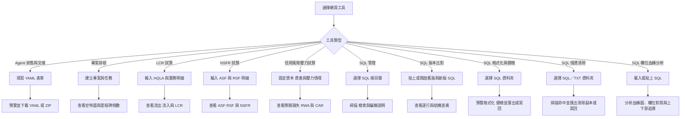

## 工具總覽

| 工具 | 入口 | 適合用途 | 資料保存方式 |
| --- | --- | --- | --- |
| Agent YAML Maker | [`agent-yaml-maker/index.html`](./agent-yaml-maker/index.html) | 建立 `progress.yaml`、`handoff.yaml`、範本與快照 | 瀏覽器 IndexedDB；主題偏好使用 `localStorage` |
| 動態甘特圖與專案倒數 | [`project-manage-calc/dynamic_gantt_project_countdown.html`](./project-manage-calc/dynamic_gantt_project_countdown.html) | 管理多個專案、任務、進度與重大里程碑 | 瀏覽器 IndexedDB |
| 臺灣 LCR Mapping 與試算 | [`lcr-mapping-calc/LCR_Mapping_SPA.html`](./lcr-mapping-calc/LCR_Mapping_SPA.html) | 查詢業務係數並計算現金流與 LCR | 僅保留在目前頁面，重新整理會清除 |
| 臺灣 NSFR 淨穩定資金比率與試算 | [`nsfr-mapping-calc/NSFR_Mapping_SPA.html`](./nsfr-mapping-calc/NSFR_Mapping_SPA.html) | 查詢 ASF／RSF 係數並計算 NSFR | IndexedDB 優先，必要時退回 `localStorage` 或僅保留於目前頁面 |
| 銀行信用風險與資本適足模擬器 | [`basel-creditrisk-calc/bank_credit_risk_capital_adequacy_simulator.html`](./basel-creditrisk-calc/bank_credit_risk_capital_adequacy_simulator.html) | 編輯信貸資產組合，觀察壓力情境下預期損失、RWA 與 CAR 敏感度 | 只保留在目前頁面；可匯出／匯入 JSON 模型 |
| SQL Catalog | [`sql-mangage/SQL_Catalog.html`](./sql-mangage/SQL_Catalog.html) | 掃描 SQL 根目錄、搜尋內容、維護用途與標籤、匯出清冊 | 根目錄 `sql_catalog.json`；瀏覽器 IndexedDB 作為快取與設定保存 |
| Oracle SQL Compare | [`sql-mangage/sql-compare.html`](./sql-mangage/sql-compare.html) | 比對兩份 Oracle SQL 的逐行內容與結構差異 | SQL 只在目前頁面處理；比對選項保存於瀏覽器 `localStorage` |
| Oracle SQL Formatter Studio | [`sql-mangage/OracleSqlFormatter.html`](./sql-mangage/OracleSqlFormatter.html) | 批次格式化 SQL／PL/SQL、執行健檢、預覽差異並匯出或寫回 | 檔案在瀏覽器本機處理；設定與健檢規則保存於 `localStorage` |
| SQL／TXT 個資掃描與清除 | [`sql-mangage/sql-pii-cleaner.html`](./sql-mangage/sql-pii-cleaner.html) | 掃描常見身分證字號、帳號、統編與擔保品編號，產生清除副本或寫回 | 檔案只在目前頁面記憶體處理，不保存掃描結果 |
| SQL Column Lineage Analyzer | [`sql-mangage/SQL_Column_Lineage_Analyzer.html`](./sql-mangage/SQL_Column_Lineage_Analyzer.html) | 分析 Oracle SQL 欄位來源、轉換、上下游影響與 CTE 結構，匯出血緣資料 | SQL 與分析結果只在目前頁面記憶體處理，不保存或上傳 |
| Markdown 卡片簡報工具 | [`ppt-present/markdown_card_presenter.html`](./ppt-present/markdown_card_presenter.html) | 以 Markdown 撰寫卡片式投影片、即時預覽、全螢幕播放，並匯出離線單一 HTML | 瀏覽器 IndexedDB（範本與草稿）；主題偏好使用 `localStorage` |

## Agent YAML Maker

### 建立進度看板或交接工單

1. 開啟 `agent-yaml-maker/index.html`。
2. 從上方範本選單選擇內建範本：軟體開發、數據分析與 ETL、規格與安全文檔，或空白模板。
3. 在「進度看板 (`progress.yaml`)」分頁填寫專案、狀態、目前階段、里程碑、工件與阻礙事項。
4. 切換到「代理交接 (`handoff.yaml`)」分頁，填寫交接單號、交付方、接收方、交接原因、已完成工作、關鍵決策、下一步與限制條件。
5. 右側預覽會即時產生 YAML；手機版可用「編輯表單」與「即時預覽」切換檢視。

### 預覽與匯出

- 按「複製」將目前分頁的 YAML 複製到剪貼簿。
- 按「下載 `.yaml`」下載目前的 `progress.yaml` 或 `handoff.yaml`。
- 按「打包 ZIP」一次下載兩個 YAML 檔案。
- 按「匯入 YAML」貼上內容或選取既有 YAML 檔；工具會辨識檔案類型並還原至對應表單。

### 範本、草稿與快照

- 「存為範本」可將目前內容建立為自訂範本。
- 範本管理中心可套用、編輯資訊、以目前畫面覆寫、複製內建範本或刪除自訂範本。
- 編輯內容會自動保存為目前草稿；「存為快照」可建立命名版本，之後可載入、下載或刪除。
- 「資料庫」維護中心可匯出 JSON 備份，也可選擇合併匯入或覆寫還原。

### 重要注意事項

- 「覆寫還原」會清除目前 IndexedDB 中的自訂範本與歷史快照；執行前請先匯出備份。
- 「清空並重設資料庫」會刪除自訂範本、快照與未保存草稿，且無法復原。
- 主題切換會記憶在目前瀏覽器；清除網站資料後需要重新設定。

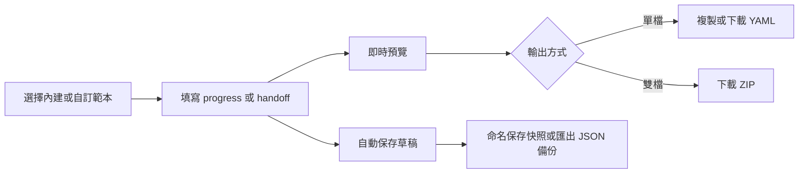

## 動態甘特圖與專案倒數看板

### 建立專案與任務

1. 開啟 [`dynamic_gantt_project_countdown.html`](./project-manage-calc/dynamic_gantt_project_countdown.html)。
2. 按「新增專案」，輸入專案名稱與簡述，再按「確認儲存」。
3. 按「新增任務」，填寫任務名稱、開始日期、截止日期、負責人、狀態與完成進度。
4. 交付節點若要顯示在上方倒數區，勾選「設為重大里程碑」。
5. 按「儲存」後，可在甘特圖查看排程；點擊既有任務可編輯或刪除。

開始日期不得晚於截止日期。狀態設為「已完成」會將進度設為 100%；進度拉到 100% 也會自動改為已完成。

### 查看與篩選排程

- 以專案選單切換工作區，倒數卡片與甘特圖會同步更新。
- 用「日檢視」或「週檢視」調整時間軸密度。
- 用狀態篩選器查看未開始、進行中、已完成或已延遲的任務。
- 按「回到今天」將時間軸捲回目前日期附近。

### 備份與還原

- 「匯出備份」會下載包含所有專案與任務的 JSON 工作區檔案。
- 「匯入資料」可還原目前工具匯出的多專案備份，也相容舊版單專案任務陣列。
- 完整工作區匯入會清除目前專案與任務，再寫入備份內容。
- 「全部重設」會永久清除所有專案、任務、里程碑與甘特圖排程，並建立一個空白預設專案；執行前請先匯出備份。

### 甘特圖使用流程

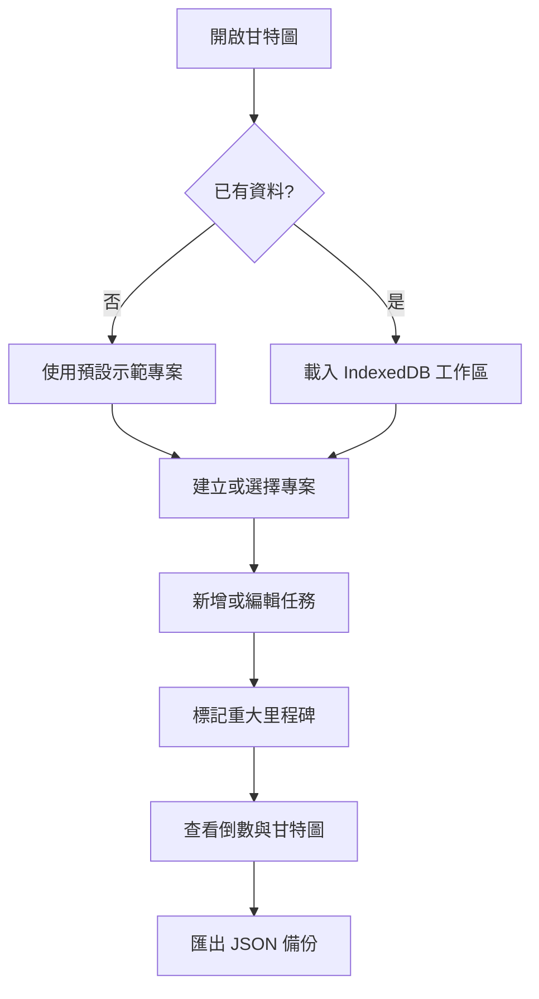

## 臺灣 LCR Mapping 與試算

### 進行試算

1. 開啟 [`LCR_Mapping_SPA.html`](./lcr-mapping-calc/LCR_Mapping_SPA.html)。
2. 在「試算」頁的「HQLA 輸入」填入已完成法規上限調整後的合格高品質流動性資產總額。
3. 從業務下拉選單選擇項目，輸入餘額後按「加入明細」。係數會依 Mapping 自動帶入。
4. 在明細表檢查方向、係數與金額；不需要的項目可按刪除。
5. 查看計算結果中的總預期現金流出、總預期現金流入、可認列流入、淨現金流出、HQLA 與 LCR。

「載入示範資料」可快速填入範例；「清空明細」只會清除目前頁面的試算明細。可在「參數」頁調整 LCR 最低標準與流入認列上限。

### 查詢 Mapping 與公式

- 「Mapping 表」可用關鍵字搜尋，並依流出／流入方向及業務大類篩選。
- 「參數」頁列出預設的 LCR 最低標準 100%、流入認列上限 75%，以及第二層資產 40%、第二層 B 級 15% 的限制說明。
- 「使用說明」頁列出公式與適用限制：`LCR = HQLA ÷ 30 日淨現金流出 × 100%`。

本工具是 Mapping 摘要與試算輔助，不取代主管機關完整條文、附錄、申報表格或正式法遵判定。複合性產品仍須依對手、剩餘期間、擔保品、可取消性與重複列計規定逐案判斷，使用前請確認相關函令是否更新。

## 臺灣 NSFR 淨穩定資金比率與試算

### 進行試算

1. 開啟 [`NSFR_Mapping_SPA.html`](./nsfr-mapping-calc/NSFR_Mapping_SPA.html)。
2. 在「試算」頁的「加入明細」下拉選單選擇 ASF（可用穩定資金）或 RSF（應有穩定資金）項目，輸入帳面金額後按「加入明細」。係數會依 Mapping 自動帶入。
3. 在明細清單檢查方向、大類、係數與加權金額；可直接修改金額，或按刪除移除不需要的項目。
4. 查看計算結果中的可用穩定資金（ASF）、應有穩定資金（RSF）、淨穩定資金比率（NSFR）與資金缺口（ASF － RSF）。

「載入示範資料」可快速填入範例；「清空明細」只會清除目前頁面的明細。可在「參數」頁調整 NSFR 最低標準與內部警示門檻。

### 查詢 Mapping 與公式

- 「Mapping 表」可用關鍵字搜尋，並依 ASF／RSF 方向及大類篩選各項目之判斷條件與係數。
- 「參數」頁列出預設的 NSFR 最低標準 100%，以及僅供提醒使用的內部警示門檻 110%。
- 「使用說明」頁列出公式與適用限制：`NSFR ＝ 可用穩定資金（ASF） ÷ 應有穩定資金（RSF） × 100%`。

本工具是 NSFR 係數對照與試算輔助，不取代主管機關完整條文、附錄、申報表格或正式法遵判定。複合性或具選擇權之商品仍須依交易對手、剩餘期間、擔保品、風險權數、受限制狀態及是否重複列計逐案判斷；表外暴險與衍生性商品淨額計算較為複雜，正式申報前請回歸主管機關計算表逐項核對，並確認相關函令是否更新。

### 資料保存與備份

- 明細與參數變更後會自動保存為草稿；「試算情境」可將目前明細命名後保存於瀏覽器本機（IndexedDB），可載入、刪除。
- 「匯出備份（JSON）」會下載包含參數、目前明細與所有情境的備份檔；「匯入備份（JSON）」可選擇合併或覆寫情境後還原。
- 換瀏覽器、使用無痕視窗或清除網站資料後，本機保存的資料可能無法取得，建議定期匯出備份。

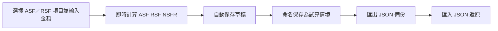

## 銀行信用風險與資本適足模擬器

此工具以資產組合參數推演不同信用壓力下的預期損失（EL）、風險性資產（RWA）與資本適足率（CAR），並提供情境比較矩陣。模型數值供情境分析與敏感度觀察，不是正式監理計算或申報結果。

### 設定資產組合與壓力情境

1. 開啟 [`bank_credit_risk_capital_adequacy_simulator.html`](./basel-creditrisk-calc/bank_credit_risk_capital_adequacy_simulator.html)。
2. 輸入合格自有資本淨額、法定最低 CAR 門檻與現有提存備抵呆帳準備金。
3. 選擇「基準常態」、「經濟景氣趨緩」或「系統性金融風暴」，也可調整 PD、LGD 與 RWA 衝擊滑桿。
4. 按「新增資產組合」，輸入名稱、曝險額（EAD）、基準違約機率（PD）、違約損失率（LGD）與風險權數（RW）；既有組合可編輯或刪除，至少保留一組。
5. 查看即時更新的總覽指標、資產組合圖表、受壓後 EL 與 RWA，以及跨情境敏感度比較矩陣。

### 匯入、匯出與重設

- 按「匯出資產模型」下載目前資本、壓力因子與資產組合資料的 JSON 檔。
- 按「匯入資產模型」選擇先前匯出的 JSON；匯入後會取代目前頁面模型，請先匯出目前資料以保留副本。
- 按「還原預設」會以內建銀行信用資產模型取代目前資料。
- 模型不會自動保存；重新整理或關閉頁面後，未匯出的修改會消失。
- 頁面使用 CDN 載入 Tailwind CSS、Chart.js、Lucide 圖示與 Google Fonts，首次完整使用需能連線至這些資源。

PD、LGD、RW 與情境衝擊假設皆可調整，結果僅供內部估算及敏感度分析。正式風險衡量、資本適足判斷與監理申報，請依適用法規、銀行內部模型及核准流程覆核。

## SQL Catalog

SQL Catalog 是單檔離線 SQL 檔案管理工具，用來建立 SQL 檔案目錄、搜尋內容並補充用途、分類、標籤與後續待辦。它只讀取與管理索引說明，不會修改 SQL 原始檔。

### 開啟目錄與掃描

1. 開啟 [`SQL_Catalog.html`](./sql-mangage/SQL_Catalog.html)。
2. 按「選擇目錄」，選取 SQL 根目錄並允許編輯權限。
3. 工具會遞迴掃描子資料夾中的 `.sql` 檔案，並在根目錄建立或讀取 `sql_catalog.json`。
4. 點選清單中的 SQL 檔案，在右側編輯用途、分類、標籤、執行頻率、到期日、後續說明與備註；內容會延遲約 1 秒自動儲存。
5. 若要重新讀取檔案狀態，按「重新掃描」。SQL 內容可在右側唯讀預覽中查看，工具也會自動判斷引用表格與語法類型。

### 搜尋、篩選與匯出

- 搜尋框可查找檔名、路徑、SQL 內容、用途與後續說明；也可依資料夾、標籤、引用表格或語法類型篩選。
- 快速篩選可查看未填用途、本次有異動、待辦逾期、待辦未完成或已遺失的檔案。
- 「批次編輯」可對選取檔案批量套用分類、標籤、頻率、到期日與後續說明；刪除已遺失紀錄前請確認不再需要該索引。
- 「分類／標籤管理」可更名、合併或刪除分類與標籤；「統計」可查看資料夾與 SQL 語法類型分布。
- 「匯出」可下載全部或目前篩選結果的 CSV、Markdown 清冊、HTML 報表與 `sql_catalog.json`；「匯入 JSON（合併）」可合併其他目錄的索引說明。
- 「打包下載」會下載 SQL 原始檔的 ZIP；請先確認檔案內容與敏感資訊的分享範圍。

### 權限與瀏覽器限制

- Chrome／Edge 支援以目錄權限讀取及寫回 `sql_catalog.json`。重新開啟頁面後，可能需要再次授權上次使用的目錄。
- 不支援 File System Access API 的瀏覽器會改用目錄檔案選取，這是唯讀模式；說明只保存於瀏覽器快取，請定期使用「匯出 → 下載 sql_catalog.json」並手動放回 SQL 根目錄。
- 儲存失敗時，工具會將資料保留在目前瀏覽器的 IndexedDB 快取；修復權限後可按「儲存」，或先匯出 JSON 備份。

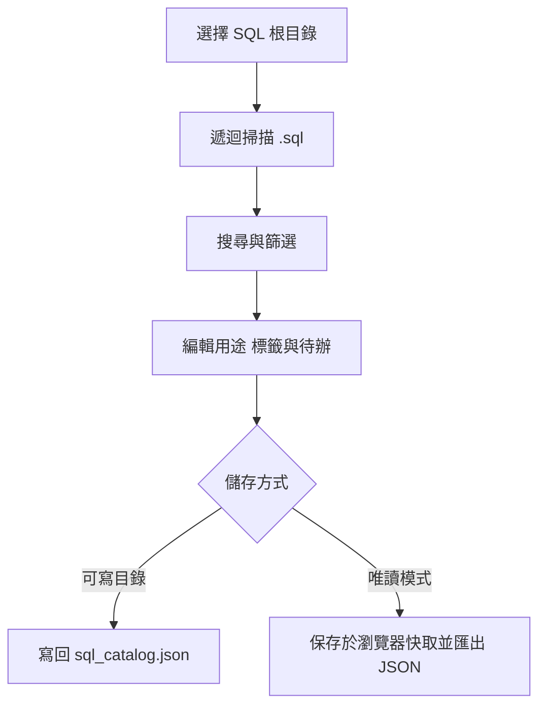

## Oracle SQL Compare

Oracle SQL Compare V2.1 是雙欄、純離線的 SQL 比對工具，適合檢查舊版與新版 Oracle SQL 的程式碼變更。可直接貼上內容、開啟檔案或將檔案拖放至「舊版／新版」窗格；支援 `.sql`、`.txt`、`.pks`、`.pkb`、`.prc`、`.fnc`、`.trg`、`.vw`、`.pls`、`.pck` 等常見副檔名。

### 比對 SQL

1. 開啟 [`sql-compare.html`](./sql-mangage/sql-compare.html)。
2. 將舊版 SQL 放入左側、新版 SQL 放入右側；可貼上文字、按「開啟檔案」或拖放檔案。
3. 依需求調整比對選項：忽略大小寫、空白、註解、空行，以及結尾 `;`／單獨一行的 `/`。
4. 按「比對」，在「逐行差異」查看新增、刪除、修改與移動內容。
5. 切換至「結構差異摘要」查看 SELECT、JOIN、欄位、條件、排序、GROUP BY、PL/SQL 或其他敘述的整理結果；摘要位置可點擊跳回逐行差異。

### 結果操作與快捷鍵

- 「並排」適合同時查看舊版與新版；「整合」適合依單一內容順序閱讀。
- 「僅顯示差異」可收合未變更區段；「上一個／下一個」可在差異區塊間巡覽。
- 「複製差異 (Unified)」與「複製結構摘要」會將結果放入剪貼簿；「匯出 HTML 報表」會下載可保存或分享的差異報表。
- `Ctrl+Enter` 執行比對；`F7`／`Shift+F7` 跳至下一個／上一個差異；`Alt+1`／`Alt+2` 切換逐行差異與結構摘要；`Esc` 返回編輯畫面。
- 「交換」可互換舊版與新版；「範例」會載入內建 Oracle SQL 範例；「清除」會移除目前兩側內容。

工具會將比對選項、顯示方式、編碼與目前頁籤保存於目前瀏覽器的 `localStorage`，不會上傳 SQL 內容。檔案讀取支援自動判斷 UTF-8／Big5，也可手動指定編碼；若要保留結果，請使用複製或 HTML 報表匯出。

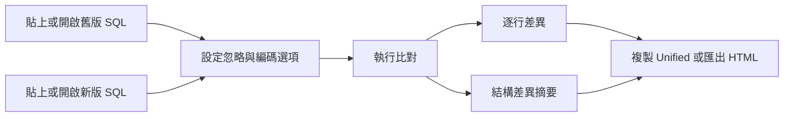

## Oracle SQL Formatter Studio

Oracle SQL Formatter Studio v1.1 是純離線的批次 SQL／PL/SQL 格式化與健檢工具。它會遞迴掃描選定資料夾中的指定副檔名，先在瀏覽器記憶體中產生格式化預覽；只有按下「寫回檔案」並確認後，才會覆寫來源檔案。

### 掃描與格式化預覽

1. 開啟 [`OracleSqlFormatter.html`](./sql-mangage/OracleSqlFormatter.html)。
2. 在「副檔名」欄確認要處理的副檔名，預設為 `.sql,.pks,.pkb,.prc,.fnc,.vw,.trg`。
3. 按「選擇資料夾」。Chrome／Edge 等支援 File System Access API 的瀏覽器可取得資料夾讀寫權限；其他瀏覽器會進入唯讀相容模式。
4. 調整檔案編碼（自動偵測 UTF-8／Big5、UTF-8 或 Big5）、縮排、識別字大小寫、SQL 關鍵字／函數大小寫與 SELECT／SET 欄位逐行排列。
5. 在左側勾選要處理的檔案，按「格式化預覽」，再從「差異預覽」逐檔檢查格式化前後內容。
6. PL/SQL 檔預設使用安全模式，只調整大小寫與行尾空白；也可選擇略過 PL/SQL，避免改變其版面。

### SQL 健檢

「SQL 健檢」會依檔案逐行列出錯誤、注意與提示，涵蓋 `= NULL`、ROWNUM 與 ORDER BY 同層、LEFT JOIN 被 WHERE 轉為 INNER、無 WHERE 的 UPDATE／DELETE、舊式逗號 JOIN、`&` 未設定 `DEFINE OFF`、PL/SQL 缺少 `/`、全形符號、不可見字元、條件欄位套用函數、`SELECT *`、`NOT IN`、CROSS JOIN、`WHERE 1=1`、高風險 DDL／DCL 與寫死的密碼等規則。

- 可依嚴重度或規則篩選問題，點擊健檢明細跳至檔案位置。
- 健檢規則可個別啟用／停用，也可調整嚴重度；「全部啟用／停用／恢復預設」會立即重新整理結果。
- 若特定行或整個檔案不需要某規則，可在 SQL 加上 `-- sqlfmt:ignore RULE_ID` 或 `-- sqlfmt:ignore-file RULE_ID`；不寫規則代碼則忽略該行或檔案的全部規則。
- 「快速測試」可直接貼上單段 SQL，立即查看格式化結果與健檢問題，不必先選擇資料夾。

### 寫回、還原與匯出

- 「寫回檔案」只會處理已勾選且預覽狀態為「有變更」的檔案。執行前會要求確認；預設先將原始檔案備份到根目錄的 `_sqlfmt_backup/<時間戳>`，完成後可用「還原本次」復原本次寫回的檔案。
- 寫回前請逐檔檢查差異與健檢結果。關閉頁面、重新整理或重新選擇資料夾後，當次「還原本次」資訊不保證保留；備份目錄才是主要復原依據。
- 「匯出 ZIP」會依原相對路徑打包勾選檔案，預覽後可取得格式化副本；唯讀相容模式只能使用此方式，不會修改來源檔案。
- 「匯出報告」會產生 HTML，包含檔案狀態、編碼、變更／失敗統計、健檢規則統計與行號明細。
- 「重新掃描」會重新讀取目前資料夾；工具會略過 `_sqlfmt_backup`、`.git`、`.svn`、`node_modules` 目錄。

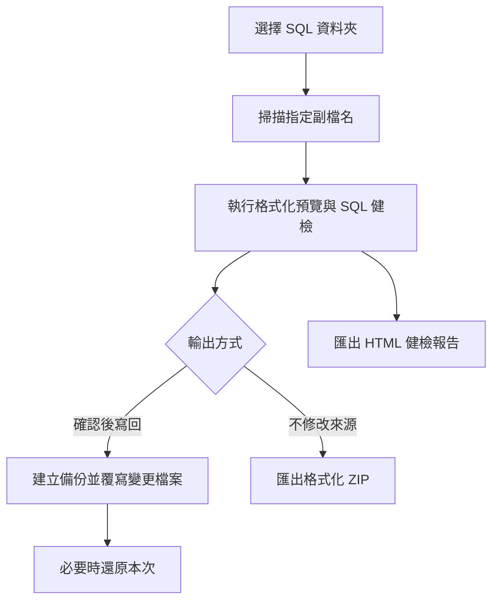

若瀏覽器不支援資料夾直接寫回，工具會使用檔案選取器載入唯讀資料；此時「寫回檔案」不可用，但仍可預覽、健檢、匯出 ZIP 與報告。格式化設定與健檢規則保存於目前瀏覽器的 `localStorage`，SQL 內容與報告均在本機處理。

## SQL／TXT 個資掃描與清除

這個工具會在瀏覽器本機遞迴掃描選定資料夾中的 `.sql` 與 `.txt` 檔案，辨識常見身分證字號、存款帳號、擔保品估價彙整序號／子號與統一編號。畫面上的命中值只會以部分遮罩呈現；工具不會將檔案上傳至外部網站。

### 掃描與檢視命中

1. 開啟 [`sql-pii-cleaner.html`](./sql-mangage/sql-pii-cleaner.html)。
2. 使用新版 Chrome 或 Edge 按「選擇資料夾（可寫回）」；若瀏覽器不支援資料夾寫入，改用「選擇資料夾（唯讀相容模式）」。
3. 確認身分證、帳號、統編、彙整編號，以及日期／時間排除規則；需要時設定排除資料夾或檔名。
4. 掃描完成後點選檔案，檢查編碼、命中數量與遮罩後的行號前後文。編碼不確定時，可在表格中改選 UTF-8、Big5、GB18030 或 UTF-16 後重新掃描。
5. 勾選要處理的檔案，再選擇寫回、下載清除後 ZIP 或匯出 CSV 報告。

### 清除與安全注意事項

- 「清除勾選檔案並寫回」只在可寫回模式可用；啟用備份時，原始檔會先保存至來源資料夾的 `_backup_時間` 目錄。
- 清除動作會直接移除命中的位元組，不是以固定字元取代；未被引號包住的命中可能造成 SQL 語法錯誤，寫回前務必檢查並保留備份。
- 「下載清除後 ZIP」不會修改來源檔案，會產生保留相對路徑與編碼的清除副本。
- 「匯出報告（CSV）」只輸出遮罩後的命中明細，不會輸出完整個資值。大量檔案建議分批處理，避免瀏覽器記憶體不足。

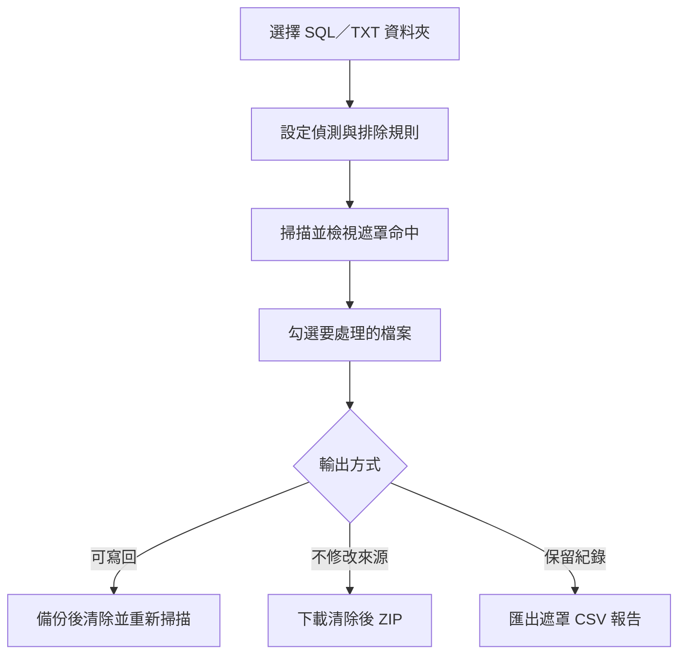

## SQL Column Lineage Analyzer

SQL Column Lineage Analyzer v1.5.1 是純離線的 Oracle SQL 欄位血緣分析器。它會在瀏覽器記憶體中解析載入的 SQL，建立資料表、CTE、View、寫入／結果物件與欄位之間的直接或間接關係；不需要後端，也不會上傳 SQL 內容。

### 載入 SQL 並分析

1. 開啟 [`SQL_Column_Lineage_Analyzer.html`](./sql-mangage/SQL_Column_Lineage_Analyzer.html)。
2. 以「載入檔案」選取一或多個 `.sql`、`.txt`、`.ddl` 檔案；也可以用「載入資料夾」遞迴載入子資料夾，或按「貼上 SQL」輸入內容。
3. 也可按「內建範例」快速載入範例；檔案可直接拖放到載入區。
4. 在左側檢查目前 SQL，按「分析」或使用 `Ctrl+Enter`。
5. 若要重新開始，按「全部清除」；此動作會移除目前載入的 SQL 與分析結果。

支援常見 Oracle SQL 結構，包括 `SELECT`、CTE、View、資料表定義、`INSERT`／`UPDATE`／`MERGE` 等寫入語句、JOIN、子查詢、集合運算，以及 PIVOT／UNPIVOT。解析器會盡可能建立欄位關係；語法不完整或不支援的語句會在「語句與訊息」頁顯示解析狀態與行號。

### 檢視血緣與欄位關係

- 「血緣圖」以物件卡片與連線呈現欄位來源；可用滑鼠拖曳畫布、滾輪縮放，切換「隱藏行內子查詢」、「完整」或「僅實體表與結果」顯示層級。
- 點選物件標題可聚焦物件，點選欄位可在右側查看運算式、直接來源、間接來源、最終來源實體表、直接下游、最終影響與條件欄位。
- 「只看選取欄位路徑」可收斂圖面；「適合視窗」與「100%」可調整視圖。血緣圖可匯出 SVG 或 PNG。
- 「欄位對照表」可依目標／來源物件、關係類型與關鍵字篩選，並查看目標欄位、來源欄位、直接／間接關係、轉換類型與運算式；可匯出 CSV、JSON 或 Mermaid。
- 「上下游追溯樹」可輸入欄位名稱或 `物件.欄位`，選擇上游、下游或上下游、追溯深度，以及是否包含間接來源與略過行內查詢。可全部展開、收合或清除重設。
- 「CTE 大綱」列出 CTE／結果物件的檔案行號、欄位數、上游物件、下游物件與未使用欄位；點選列可跳回血緣圖聚焦。
- 「語句與訊息」列出解析語句狀態與警告／錯誤；可勾選「只看警告／錯誤」縮小範圍。

### 使用流程

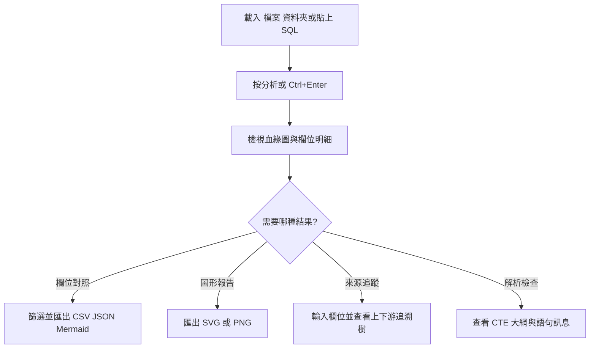

SQL、圖形與分析結果只保留在目前頁面記憶體；重新整理、關閉頁面或按「全部清除」後需要重新載入。匯出檔案可能包含原始欄位名稱、表名與運算式，分享前請確認 SQL 的敏感資訊範圍。

## Markdown 卡片簡報工具 (Card Presenter)

Card Presenter 是單檔的卡片式投影片編輯器：可用 Markdown（含自訂的 KPI、多欄卡片與提示框區塊）撰寫內容，右側即時預覽，並以全螢幕模式播放。它也能將整份簡報匯出為完全不依賴外部資源的單一 HTML 檔。

### 編輯與預覽

1. 開啟 [`markdown_card_presenter.html`](./ppt-present/markdown_card_presenter.html)。
2. 在左側編輯區輸入 Markdown；以獨立一行的 `---` 切分不同頁面。
3. 可用工具列的「📊 KPI 指標」、「🗂️ 雙欄卡片」、「💡 提示框」快速插入語法片段。
4. 右側預覽會即時更新，每張卡片右下角顯示頁碼。

支援的區塊語法：

- 標題與清單：`#`、`##`、`- `、`> ` 引言、`**粗體**`、`*斜體*`、`` `程式碼` ``。
- KPI 指標：`::: kpi [標籤] 值 [status: success|warning|danger|info]`；連續多行 KPI 會自動併排顯示。
- 多欄卡片：`::: columns 2`（或 `3`）搭配多個 `::: card [標題]`，最後以 `:::` 收合。
- 提示框：`::: callout [info|success|warning]` 之後放入內容，再以 `:::` 收合。

### 播放與匯出

- 按「▶️ 播放簡報」或 `F` 鍵進入全螢幕播放；`←`／`→`（或空白鍵）換頁，`Esc` 離開。
- 按「💾 匯出展示檔」會下載一個獨立的 HTML 檔，內含所有頁面與樣式，可離線開啟與分享。
- 深色／淺色模式可從右上角 ☀️／🌙 切換。

### 範本與保存

- 內建三個範本，可從上方範本選單套用。
- 「➕」可將目前編輯內容存為自訂範本；「🔄」可還原為系統預設範本（會清除自訂範本，但保留編輯區文字）。
- 範本與編輯草稿保存在瀏覽器 IndexedDB，主題偏好保存在 `localStorage`；換瀏覽器或清除網站資料後可能無法取得，重要簡報請先匯出 HTML。

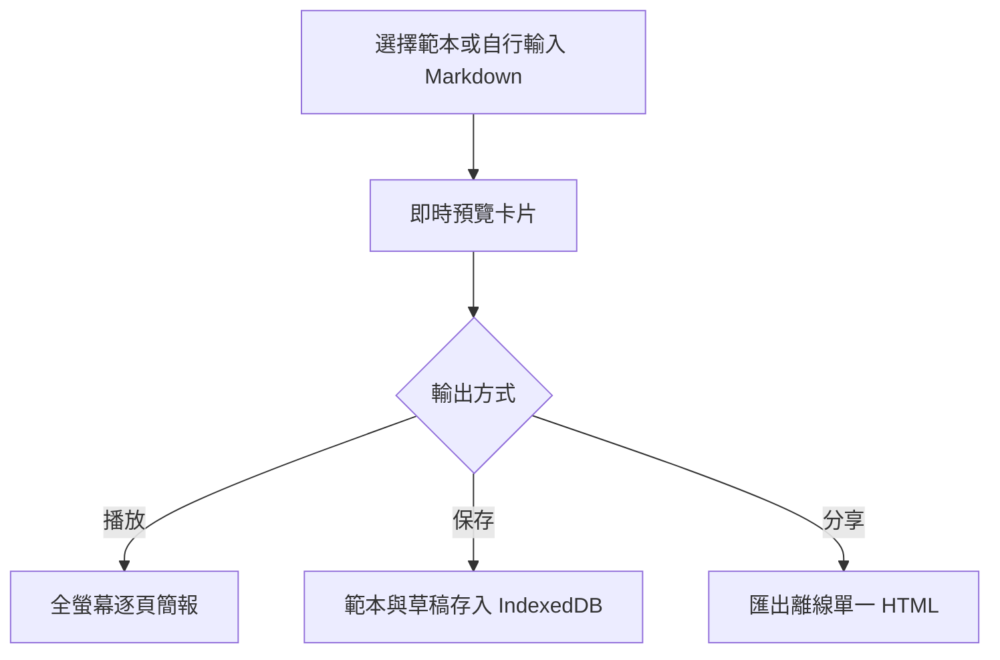

本工具的編輯介面樣式由 CDN 載入 Tailwind CSS，首次開啟需保持網路連線；但「匯出展示檔」產生的 HTML 不含任何外部依賴，可完全離線使用。

## 資料保存、匯出與隱私

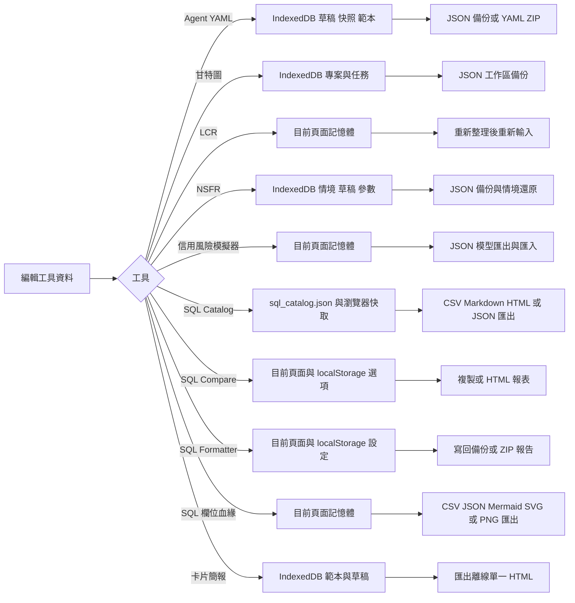

- Agent YAML Maker 與甘特圖資料保存在目前瀏覽器的 IndexedDB；換瀏覽器、使用無痕視窗或清除網站資料後，資料可能無法取得。
- LCR 工具不自動保存、不上傳資料，也沒有內建匯出功能；重要結果請自行複製或列印保存。
- NSFR 工具會將情境、編輯草稿與參數保存在目前瀏覽器的 IndexedDB，並提供 JSON 匯出／匯入備份；主題偏好使用 `localStorage`。若瀏覽器不支援持久化（例如部分 `file://` 環境），資料僅保留於目前頁面，請使用「匯出備份」保存。
- 銀行信用風險模擬器不會自動保存模型；頁面重新整理或關閉後，資料會遺失。請使用 JSON 匯出／匯入保留或移轉模型。該頁也會從 CDN 載入前端資源。
- SQL Catalog 會讀取使用者選定目錄中的 SQL 檔案，索引說明預設寫入該目錄的 `sql_catalog.json`；不支援目錄寫入時則保存於目前瀏覽器的 IndexedDB 快取。工具沒有遠端同步或後端上傳功能。
- Oracle SQL Compare 與 Oracle SQL Formatter Studio 都在瀏覽器本機處理 SQL；前者不修改來源檔案，後者只有在使用者確認「寫回檔案」時才會覆寫，且預設先建立 `_sqlfmt_backup` 備份。
- SQL／TXT 個資清除工具只在目前頁面記憶體中處理檔案；關閉或重新整理後需重新選取資料夾。可寫回模式會依設定建立 `_backup_時間` 備份，唯讀模式請使用 ZIP 保存結果。
- SQL Column Lineage Analyzer 只在目前頁面記憶體中解析 SQL 與建立血緣結果；不使用 IndexedDB 或 `localStorage`，關閉、重新整理或清除頁面後需重新載入。CSV、JSON、Mermaid、SVG 與 PNG 都是由使用者主動下載的輸出檔。
- Markdown 卡片簡報工具會將範本與編輯草稿保存在目前瀏覽器的 IndexedDB，主題偏好使用 `localStorage`；「匯出展示檔」產生完全離線的單一 HTML，但編輯介面樣式仍由 CDN 載入 Tailwind CSS。
- 本專案沒有內建後端同步。外部 CDN 只提供部分工具（Agent YAML Maker、甘特圖、銀行信用風險模擬器與 Markdown 卡片簡報工具）所需的樣式、圖示或函式庫，不代表使用者資料會上傳至本專案伺服器。
- 需要跨電腦或防止瀏覽器資料遺失時，請優先使用工具提供的 JSON、YAML 或 ZIP 匯出功能。

## 技術棧與離線範圍

本節依目前各入口頁面的實際程式整理。專案由多個獨立 HTML 頁面組成，使用 HTML5、CSS3、原生 JavaScript 與響應式版面；沒有統一的建置／打包流程、根目錄 `package.json` 或專用後端。實際使用技術棧與 `docs\\使用技術棧.md` 的公版規範不完全一致：部分頁面使用 CDN 載入外部函式庫，且各工具自行決定資料保存方式。

### 外部資源與離線需求

- Agent YAML Maker：從 CDN 載入 Tailwind CSS、js-yaml、JSZip 與 Google Fonts。
- 動態甘特圖與專案倒數：從 CDN 載入 Tailwind CSS 與 Lucide 圖示。
- 銀行信用風險與資本適足模擬器：從 CDN 載入 Tailwind CSS、Chart.js、Lucide 圖示與 Google Fonts。
- Markdown 卡片簡報工具：編輯介面從 CDN 載入 Tailwind CSS；「匯出展示檔」產生的單一 HTML 不含外部依賴。
- 其他入口的主要邏輯在瀏覽器執行，不依賴上述共用外部函式庫；SQL Column Lineage Analyzer 也不依賴外部 CDN。

Agent YAML Maker、甘特圖、信用風險模擬器與 Markdown 卡片簡報工具若無法取得 CDN 資源，可能出現樣式、圖示、圖表或相關功能缺漏。其他工具的本機功能可在無網路時使用，但選取資料夾、讀寫檔案等能力仍受瀏覽器支援與 `file://` 安全限制影響；SQL Catalog、SQL Formatter 與個資清除工具建議使用 Chrome 或 Edge，並依畫面提示授權資料夾。

### 瀏覽器資料保存

- Agent YAML Maker 使用 IndexedDB 保存草稿、快照與範本，並以 `localStorage` 記憶主題；甘特圖使用 IndexedDB 保存專案與任務。
- Markdown 卡片簡報工具使用 IndexedDB 保存範本與編輯草稿，並以 `localStorage` 記憶主題偏好。
- NSFR 優先使用 IndexedDB，無法使用時退回 `localStorage`，再退回目前頁面記憶體。
- SQL Catalog 將目錄說明寫入使用者選定根目錄的 `sql_catalog.json`，並以 IndexedDB 保存瀏覽器快取與設定。
- SQL Compare、SQL Formatter 與 NSFR 主題等偏好／選項會使用 `localStorage`。
- LCR 與信用風險模擬器不會自動保存試算資料；其他未列出的臨時分析內容則依各工具說明於目前頁面處理。

本機處理表示主要計算與檔案操作在瀏覽器端執行，不代表每個入口都能完全離線啟動，也不代表瀏覽器資料會自動同步或備份。重要資料請使用各工具提供的匯出功能另存檔案。

## 常見問題

### 開啟後畫面樣式不完整或按鈕沒有作用

確認瀏覽器可以連線到工具引用的 CDN（Agent YAML Maker、甘特圖與銀行信用風險模擬器）；也可改用 `python -m http.server 8080` 後從 `http://localhost:8080/` 開啟。LCR 與 NSFR 工具為純離線、不依賴 CDN，若仍異常，請確認開啟的是對應子資料夾（`lcr-mapping-calc` 或 `nsfr-mapping-calc`）內的入口檔。

### 甘特圖或 Agent YAML 的資料不見了

確認使用同一個瀏覽器、同一種一般視窗，且沒有清除網站資料。甘特圖請用 JSON 匯入還原；Agent YAML Maker 請使用資料庫 JSON 備份或快照還原。

### 看不到甘特圖倒數卡片

只有勾選「設為重大里程碑」的任務才會顯示在上方倒數區；請編輯任務並確認勾選狀態與截止日期。

### YAML 匯入或 JSON 還原失敗

請確認檔案是由對應工具匯出的完整檔案，沒有被截斷或手動改壞。Agent YAML Maker 的資料庫備份可選擇合併或覆寫；甘特圖完整工作區匯入會取代現有工作區。

### LCR 結果與預期不同

檢查 HQLA 是否為完成上限調整後的淨額、業務方向與係數是否正確，以及流入上限與最低標準是否符合目前採用的規範。必要時回到「Mapping 表」核對適用條件。

### NSFR 結果與預期不同

檢查 ASF／RSF 各項目是否歸類正確、係數是否適用，以及金額是否為基準日之帳面金額；必要時回到「Mapping 表」核對判斷條件與剩餘期間。

### NSFR 情境載入後覆蓋了目前明細

載入情境前工具會先確認；若誤覆蓋，可從 JSON 匯出備份還原，或重新加入明細。

### SQL Catalog 無法選取或儲存目錄

請改用 Chrome 或 Edge，透過靜態檔案伺服器開啟頁面並重新授權目錄。若只能使用唯讀模式，請在每次編輯後匯出 `sql_catalog.json`；該模式不會直接寫回 SQL 根目錄。

### SQL Catalog 顯示檔案已遺失

請確認檔案仍位於原本的根目錄與相對路徑，再按「重新掃描」。若檔案已永久移除，可在批次編輯中移除已遺失紀錄；這只會刪除索引，不會復原或刪除原始檔。

### SQL Compare 的結果與預期不同

檢查是否勾選了忽略大小寫、空白、註解、空行或結尾分隔符；這些選項會改變比對結果。若需要確認原始文字差異，請關閉相關忽略選項，並確認兩份檔案的編碼設定正確。

### SQL Formatter 無法寫回檔案

請使用支援 File System Access API 的 Chrome／Edge，並透過「選擇資料夾」重新授予讀寫權限。若仍使用唯讀相容模式，請改以「匯出 ZIP」取得格式化副本；唯讀模式不會修改來源檔案。

### SQL Formatter 預覽沒有變更

確認檔案已勾選，且格式化設定沒有被保存的舊設定覆蓋；設定變更後必須重新按「格式化預覽」。若檔案是 PL/SQL，預設安全模式只調整大小寫，或目前已選擇略過 PL/SQL，也可能看不到版面變化。

### SQL Formatter 寫回前要如何復原

預設設定會在根目錄建立 `_sqlfmt_backup/<時間戳>`；同一頁工作階段可按「還原本次」。若已關閉頁面或重新整理，請從備份目錄手動還原，並先確認備份檔案與原始相對路徑。

### SQL／TXT 個資清除工具如何避免誤判或遺失原檔

先調整日期／時間排除選項與檢查碼規則，再查看遮罩後的命中前後文；不要未檢查就直接寫回。建議保留「寫回前備份」，或改用「下載清除後 ZIP」在副本上驗證。工具只掃描 `.sql` 與 `.txt`，且不會自動修正清除後可能產生的 SQL 語法問題。

### SQL Column Lineage Analyzer 沒有解析出完整血緣

先到「語句與訊息」查看錯誤或警告及對應行號，再確認 SQL 語法完整、別名與欄位名稱沒有歧義。若欄位名稱在多個物件中重複，請在「上下游追溯樹」使用 `物件.欄位` 指定起點；必要時降低追溯深度或關閉「略過行內查詢」後重新查看。分析器是靜態解析輔助工具，不能取代資料庫實際執行計畫或人工審查。

### Card Presenter 開啟後沒有樣式

編輯介面樣式由 CDN 載入 Tailwind CSS，請確認瀏覽器可連線至網路，或改以 `python -m http.server 8080` 後從 `http://localhost:8080/ppt-present/` 開啟。若只是要分享簡報，按「匯出展示檔」取得的單一 HTML 不含外部依賴，可離線開啟。

### Card Presenter 的範本或草稿不見了

確認使用同一個瀏覽器與一般視窗，且沒有清除網站資料；範本與草稿存放在瀏覽器 IndexedDB。若資料遺失，可重新套用內建範本，或改用「匯出展示檔」保存成品。

## 維護者驗證

本專案是免建置的靜態 HTML／CSS／JavaScript 專案，沒有統一的 npm 測試指令。實際頁面同時使用原生 HTML／CSS／Vanilla JavaScript；Agent YAML Maker、甘特圖、信用風險模擬器與 Markdown 卡片簡報工具透過 CDN 載入部分資源，這是目前程式現況。`docs\使用技術棧.md` 是目標技術棧規範，若要達成完全離線的共通標準，仍需另行移除或內嵌這些 CDN 依賴。修改文件後可先執行：

```powershell
git diff --check -- README.md
```

若修改網頁程式，請分別在現代瀏覽器開啟十一個入口，至少確認：Agent YAML Maker 可切換兩個 YAML 分頁並下載檔案、甘特圖可建立專案與任務並重新整理後保留資料、LCR 可加入明細並更新計算結果、NSFR 可加入 ASF／RSF 明細並計算 NSFR 且能保存與載入情境、信用風險模擬器可新增資產組合／切換壓力情境／匯出並匯入 JSON、SQL Catalog 可選取目錄／掃描 SQL／編輯說明並匯出 `sql_catalog.json`、SQL Compare 可載入兩份 SQL 並產生逐行與結構摘要、Oracle SQL Formatter 可掃描資料夾／預覽格式化／執行健檢並以 ZIP 或寫回方式輸出、SQL／TXT 個資工具可掃描命中／產生遮罩報告並以 ZIP 或備份後寫回輸出、SQL Column Lineage Analyzer 可載入或貼上 SQL／執行分析／查看血緣圖與上下游追溯，並匯出 CSV、JSON、Mermaid、SVG 或 PNG、Markdown 卡片簡報工具可輸入 Markdown／切分頁面／全螢幕播放／套用與儲存範本，並匯出可離線開啟的單一 HTML。SQL Catalog、SQL Formatter 與個資工具的目錄權限及瀏覽器相容性仍需實機驗證。
