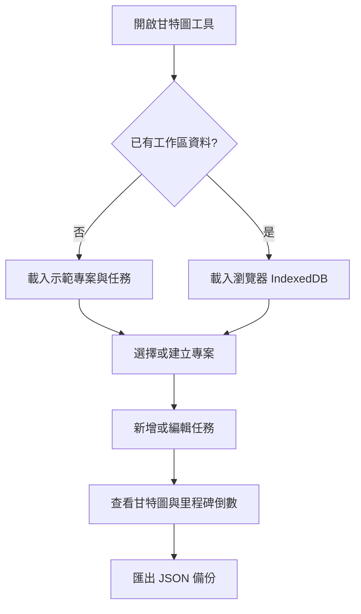

# SPA 網頁小工具

本專案提供數個可直接在瀏覽器開啟的單頁應用程式（SPA），目前包含 LCR 試算工具，以及用於管理多個專案排程的甘特圖與倒數看板。

## 目錄

- [快速開始](#快速開始)
- [網頁工具](#網頁工具)
- [動態甘特圖與專案倒數看板](#動態甘特圖與專案倒數看板)
- [LCR Mapping 與試算工具](#lcr-mapping-與試算工具)
- [資料保存與備份](#資料保存與備份)
- [常見問題](#常見問題)

## 快速開始

1. 下載或複製本專案到電腦。
2. 直接以瀏覽器開啟對應的 `.html` 檔案即可使用。
3. 若瀏覽器限制本機檔案功能，可在專案目錄啟動簡易伺服器，再開啟終端機顯示的網址：

   ```powershell
   npx -y serve .
   ```

本專案目前沒有需要執行的建置流程；使用者操作請以瀏覽器中的網頁介面為準。

## 網頁工具

| 工具 | 開啟檔案 | 用途 |
| --- | --- | --- |
| 動態甘特圖與專案倒數看板 | [`dynamic_gantt_project_countdown.html`](./dynamic_gantt_project_countdown.html) | 管理多個專案、任務排程、完成進度與重大里程碑倒數 |
| LCR Mapping 與試算工具 | [`LCR_Mapping_SPA.html`](./LCR_Mapping_SPA.html) | 查詢臺灣 LCR 業務係數並試算流出、流入、HQLA 與 LCR |

## 動態甘特圖與專案倒數看板

### 主要介面

- **專案選擇器**：切換目前要查看的專案。
- **重要里程碑倒數（D-Day）**：顯示被標記為里程碑的任務，並即時計算剩餘天數、逾期天數或完成狀態。
- **甘特圖排程**：以時間軸查看任務，支援「日檢視」與「週檢視」。
- **狀態篩選**：可依未開始、進行中、已完成或已延遲篩選任務。

### 建立專案

1. 點選上方專案區域的「新增專案」按鈕。
2. 輸入專案名稱；專案簡述可選填。
3. 點選「確認儲存」，新專案會成為目前選取的專案。

若要修改目前專案，點選「專案設定」即可變更名稱或簡述。刪除專案會連同該專案的所有任務與排程一起刪除，且無法復原；刪除前建議先匯出備份。

### 新增與編輯任務

1. 點選「新增任務」。
2. 填寫任務名稱、開始日期與截止日期；負責人可選填。
3. 選擇任務狀態並調整完成進度。
4. 若任務是重要交付節點，勾選「設為重大里程碑」。
5. 點選「儲存」。

在甘特圖中點選既有任務可重新編輯或刪除。開始日期不得晚於截止日期；進度調整為 100% 時會自動標示為「已完成」，選擇「已完成」也會將進度設為 100%。

### 甘特圖操作

- 使用「日檢視」查看每日排程，或使用「週檢視」取得較精簡的長期視角。
- 使用狀態篩選器只顯示特定狀態的任務。
- 點選「回到今天」將時間軸捲動到目前日期附近。
- 切換專案後，倒數看板與甘特圖會同步顯示該專案的資料。

## LCR Mapping 與試算工具

### 試算流程

1. 開啟 [`LCR_Mapping_SPA.html`](./LCR_Mapping_SPA.html)。
2. 在「HQLA 輸入」填入已完成法規上限調整後的合格高品質流動性資產淨額。
3. 從業務下拉選單選擇項目，輸入餘額後按「加入明細」。
4. 在明細表直接調整餘額，或刪除不需要的項目。
5. 「計算結果」區會即時顯示流出、流入、淨現金流出、HQLA 與 LCR。

工具也提供「載入示範資料」與「清空明細」功能。清空前請確認不需要保留目前畫面中的試算內容。

### Mapping 查詢與參數

- 「Mapping 表」可用關鍵字搜尋，並依流出／流入方向或業務大類篩選。
- 「參數」可調整 LCR 最低標準與流入認列上限；第二層資產 40% 與第二層 B 級 15% 的限制會列在頁面中。
- 「使用說明」頁面提供公式與適用限制。此工具是試算輔助，不取代正式法遵或監理判定。

## 資料保存與備份

動態甘特圖工具會將專案與任務儲存在目前瀏覽器的 IndexedDB，因此重新開啟同一瀏覽器通常仍可看到資料；清除瀏覽器網站資料、改用其他瀏覽器或無痕視窗時，資料可能無法取得。

建議在重大變更前使用「匯出備份」下載 JSON 檔案。需要還原時，使用「匯入資料」選取先前匯出的 JSON；匯入完整工作區會取代目前的專案與任務資料。匯入不相符的檔案會被拒絕。



### 隱私與網路需求

- 甘特圖的專案與任務資料以本機 IndexedDB 儲存，程式沒有內建後端同步功能。
- 甘特圖頁面的 Tailwind CSS 與 Lucide 圖示透過 CDN 載入；首次開啟或需要完整樣式／圖示時建議保持網路連線。
- LCR 工具的試算資料只存在目前頁面，不會自動保存或上傳；重新整理後需重新輸入。

## 常見問題

### 重新整理後甘特圖資料不見了

先確認是否使用同一個瀏覽器與一般視窗，且沒有清除網站資料。若曾經匯出 JSON，請使用「匯入資料」還原；若 IndexedDB 初始化失敗，頁面可能只會暫時使用記憶體資料。

### 為什麼看不到倒數卡片？

只有勾選「設為重大里程碑」的任務才會顯示在倒數看板。請編輯任務並勾選該選項。

### 匯入 JSON 失敗

請確認選取的是本工具匯出的 JSON 檔案，且檔案內容未被修改或截斷。匯入操作會檢查格式，不符合格式的檔案不會寫入工作區。

### LCR 數值與預期不同

檢查 HQLA 是否填入已完成上限調整後的淨額、業務方向是否正確，以及「參數」中的最低標準與流入認列上限是否符合目前採用的規範。

## 維護者驗證

修改 README 或網頁後，可執行以下檢查：

```powershell
git diff --check -- README.md
```

若需要確認網頁能正常載入，請直接在瀏覽器開啟兩個 HTML 檔案，並各自操作主要流程。
