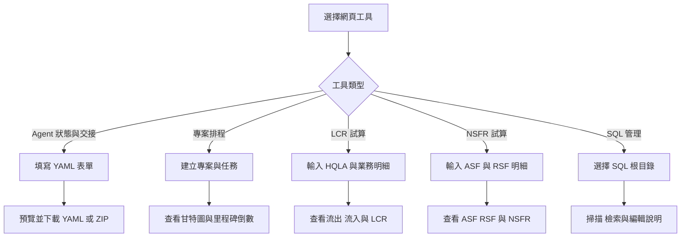
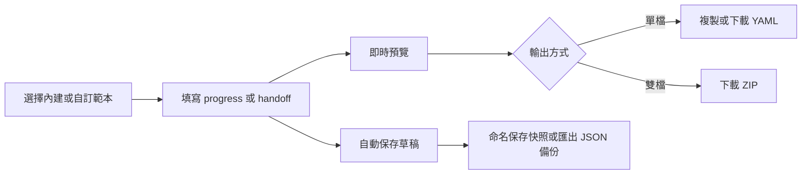
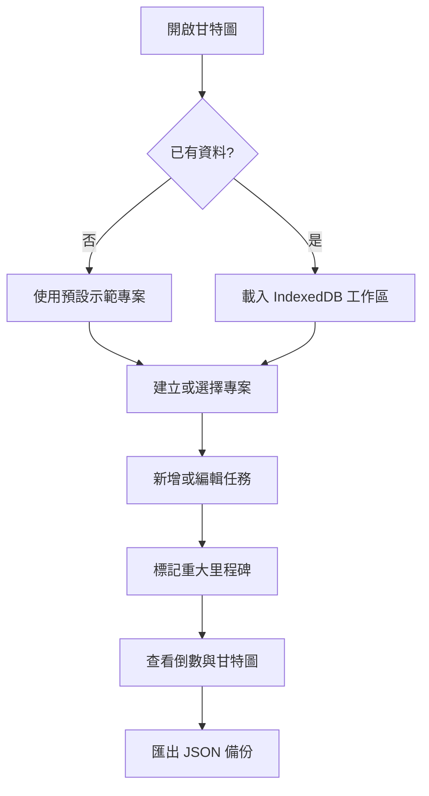
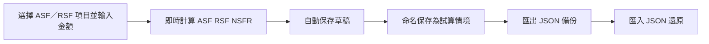
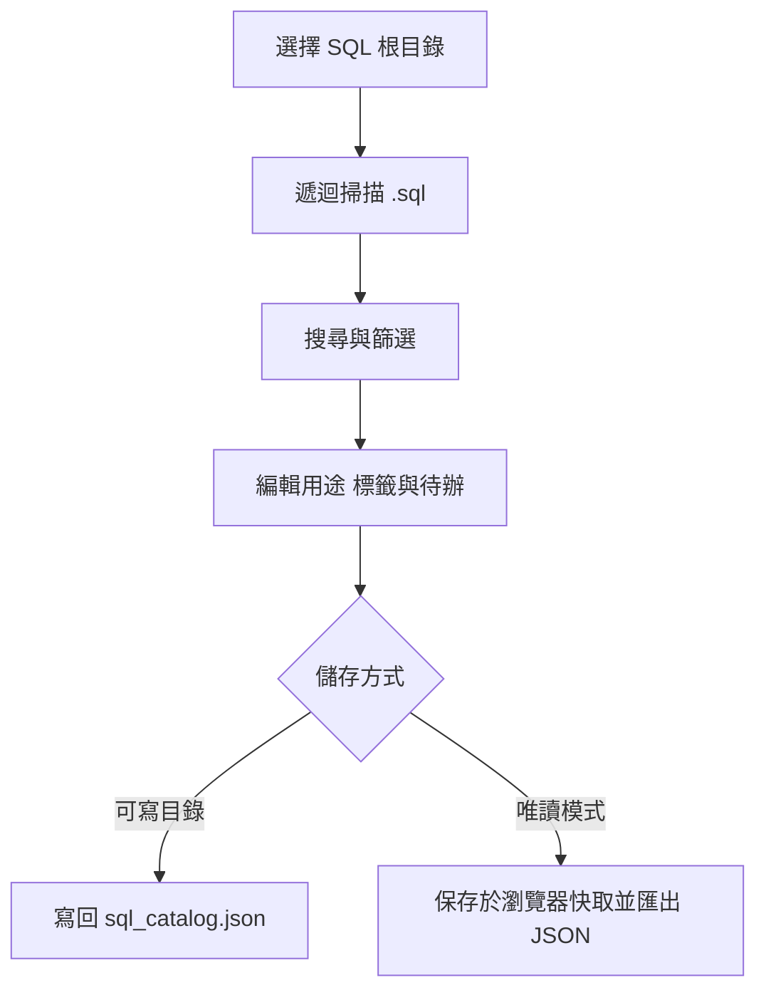
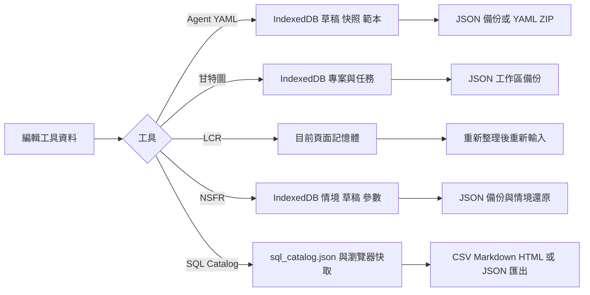

# SPA 網頁小工具使用者操作手冊

本專案提供五個可在瀏覽器中直接使用的單頁網頁工具：AI Agent YAML 狀態與交接檔產生器、專案甘特圖與倒數看板、臺灣 LCR Mapping 試算工具、臺灣 NSFR 淨穩定資金比率試算工具，以及 SQL Catalog 檔案管理工具。工具不需要本專案專用後端；請依需求開啟對應的 HTML 入口。

## 目錄

- [快速開始](#快速開始)
- [整體使用流程](#整體使用流程)
- [工具總覽](#工具總覽)
- [Agent YAML Maker](#agent-yaml-maker)
- [動態甘特圖與專案倒數看板](#動態甘特圖與專案倒數看板)
- [臺灣 LCR Mapping 與試算](#臺灣-lcr-mapping-與試算)
- [臺灣 NSFR 淨穩定資金比率與試算](#臺灣-nsfr-淨穩定資金比率與試算)
- [SQL Catalog](#sql-catalog)
- [資料保存、匯出與隱私](#資料保存匯出與隱私)
- [常見問題](#常見問題)
- [維護者驗證](#維護者驗證)

## 快速開始

1. 下載或複製本專案。
2. 在檔案總管中開啟下列任一入口：
   - [`agent-yaml-maker/index.html`](./agent-yaml-maker/index.html)
   - [`project-manage-calc/dynamic_gantt_project_countdown.html`](./project-manage-calc/dynamic_gantt_project_countdown.html)
   - [`lcr-mapping-calc/LCR_Mapping_SPA.html`](./lcr-mapping-calc/LCR_Mapping_SPA.html)
   - [`nsfr-mapping-calc/NSFR_Mapping_SPA.html`](./nsfr-mapping-calc/NSFR_Mapping_SPA.html)
   - [`sql-mangage/SQL_Catalog.html`](./sql-mangage/SQL_Catalog.html)
3. 使用瀏覽器頁面中的表單、按鈕與分頁完成操作。

本專案沒有建置或打包步驟，也沒有根目錄 `package.json`。若瀏覽器限制 `file://` 頁面的部分功能，可在專案根目錄啟動任一靜態檔案伺服器，例如：

```powershell
python -m http.server 8080
```

再開啟 `http://localhost:8080/`，並進入上述子目錄。Agent YAML Maker 與甘特圖工具會從 CDN 載入部分樣式或函式庫；若要完整使用，首次開啟時請保持網路連線。LCR、NSFR 工具與 SQL Catalog 不依賴外部函式庫，可直接離線開啟；SQL Catalog 的「選擇目錄」功能建議使用 Chrome 或 Edge。

## 整體使用流程



## 工具總覽

| 工具 | 入口 | 適合用途 | 資料保存方式 |
| --- | --- | --- | --- |
| Agent YAML Maker | [`agent-yaml-maker/index.html`](./agent-yaml-maker/index.html) | 建立 `progress.yaml`、`handoff.yaml`、範本與快照 | 瀏覽器 IndexedDB；主題偏好使用 `localStorage` |
| 動態甘特圖與專案倒數 | [`project-manage-calc/dynamic_gantt_project_countdown.html`](./project-manage-calc/dynamic_gantt_project_countdown.html) | 管理多個專案、任務、進度與重大里程碑 | 瀏覽器 IndexedDB |
| 臺灣 LCR Mapping 與試算 | [`lcr-mapping-calc/LCR_Mapping_SPA.html`](./lcr-mapping-calc/LCR_Mapping_SPA.html) | 查詢業務係數並計算現金流與 LCR | 僅保留在目前頁面，重新整理會清除 |
| 臺灣 NSFR 淨穩定資金比率與試算 | [`nsfr-mapping-calc/NSFR_Mapping_SPA.html`](./nsfr-mapping-calc/NSFR_Mapping_SPA.html) | 查詢 ASF／RSF 係數並計算 NSFR | 瀏覽器 IndexedDB（情境、草稿、參數）；主題偏好使用 `localStorage` |
| SQL Catalog | [`sql-mangage/SQL_Catalog.html`](./sql-mangage/SQL_Catalog.html) | 掃描 SQL 根目錄、搜尋內容、維護用途與標籤、匯出清冊 | 根目錄 `sql_catalog.json`；瀏覽器 IndexedDB 作為快取與設定保存 |

## Agent YAML Maker

### 建立進度看板或交接工單

1. 開啟 `agent-yaml-maker/index.html`。
2. 從上方範本選單選擇內建範本：軟體開發、數據分析與 ETL、規格與安全文檔，或空白模板。
3. 在「進度看板 (`progress.yaml`)」分頁填寫專案、狀態、目前階段、里程碑、工件與阻礙事項。
4. 切換到「代理交接 (`handoff.yaml`)」分頁，填寫交接單號、交付方、接收方、交接原因、已完成工作、關鍵決策、下一步與限制條件。
5. 右側預覽會即時產生 YAML；手機版可用「編輯表單」與「即時預覽」切換檢視。

### 預覽與匯出

- 按「複製」將目前分頁的 YAML 複製到剪貼簿。
- 按「下載 `.yaml`」下載目前的 `progress.yaml` 或 `handoff.yaml`。
- 按「打包 ZIP」一次下載兩個 YAML 檔案。
- 按「匯入 YAML」貼上內容或選取既有 YAML 檔；工具會辨識檔案類型並還原至對應表單。

### 範本、草稿與快照

- 「存為範本」可將目前內容建立為自訂範本。
- 範本管理中心可套用、編輯資訊、以目前畫面覆寫、複製內建範本或刪除自訂範本。
- 編輯內容會自動保存為目前草稿；「存為快照」可建立命名版本，之後可載入、下載或刪除。
- 「資料庫」維護中心可匯出 JSON 備份，也可選擇合併匯入或覆寫還原。

### 重要注意事項

- 「覆寫還原」會清除目前 IndexedDB 中的自訂範本與歷史快照；執行前請先匯出備份。
- 「清空並重設資料庫」會刪除自訂範本、快照與未保存草稿，且無法復原。
- 主題切換會記憶在目前瀏覽器；清除網站資料後需要重新設定。



## 動態甘特圖與專案倒數看板

### 建立專案與任務

1. 開啟 [`dynamic_gantt_project_countdown.html`](./project-manage-calc/dynamic_gantt_project_countdown.html)。
2. 按「新增專案」，輸入專案名稱與簡述，再按「確認儲存」。
3. 按「新增任務」，填寫任務名稱、開始日期、截止日期、負責人、狀態與完成進度。
4. 交付節點若要顯示在上方倒數區，勾選「設為重大里程碑」。
5. 按「儲存」後，可在甘特圖查看排程；點擊既有任務可編輯或刪除。

開始日期不得晚於截止日期。狀態設為「已完成」會將進度設為 100%；進度拉到 100% 也會自動改為已完成。

### 查看與篩選排程

- 以專案選單切換工作區，倒數卡片與甘特圖會同步更新。
- 用「日檢視」或「週檢視」調整時間軸密度。
- 用狀態篩選器查看未開始、進行中、已完成或已延遲的任務。
- 按「回到今天」將時間軸捲回目前日期附近。

### 備份與還原

- 「匯出備份」會下載包含所有專案與任務的 JSON 工作區檔案。
- 「匯入資料」可還原目前工具匯出的多專案備份，也相容舊版單專案任務陣列。
- 完整工作區匯入會清除目前專案與任務，再寫入備份內容。
- 「全部重設」會永久清除所有專案、任務、里程碑與甘特圖排程，並建立一個空白預設專案；執行前請先匯出備份。

### 甘特圖使用流程



## 臺灣 LCR Mapping 與試算

### 進行試算

1. 開啟 [`LCR_Mapping_SPA.html`](./lcr-mapping-calc/LCR_Mapping_SPA.html)。
2. 在「試算」頁的「HQLA 輸入」填入已完成法規上限調整後的合格高品質流動性資產總額。
3. 從業務下拉選單選擇項目，輸入餘額後按「加入明細」。係數會依 Mapping 自動帶入。
4. 在明細表檢查方向、係數與金額；不需要的項目可按刪除。
5. 查看計算結果中的總預期現金流出、總預期現金流入、可認列流入、淨現金流出、HQLA 與 LCR。

「載入示範資料」可快速填入範例；「清空明細」只會清除目前頁面的試算明細。可在「參數」頁調整 LCR 最低標準與流入認列上限。

### 查詢 Mapping 與公式

- 「Mapping 表」可用關鍵字搜尋，並依流出／流入方向及業務大類篩選。
- 「參數」頁列出預設的 LCR 最低標準 100%、流入認列上限 75%，以及第二層資產 40%、第二層 B 級 15% 的限制說明。
- 「使用說明」頁列出公式與適用限制：`LCR = HQLA ÷ 30 日淨現金流出 × 100%`。

本工具是 Mapping 摘要與試算輔助，不取代主管機關完整條文、附錄、申報表格或正式法遵判定。複合性產品仍須依對手、剩餘期間、擔保品、可取消性與重複列計規定逐案判斷，使用前請確認相關函令是否更新。

## 臺灣 NSFR 淨穩定資金比率與試算

### 進行試算

1. 開啟 [`NSFR_Mapping_SPA.html`](./nsfr-mapping-calc/NSFR_Mapping_SPA.html)。
2. 在「試算」頁的「加入明細」下拉選單選擇 ASF（可用穩定資金）或 RSF（應有穩定資金）項目，輸入帳面金額後按「加入明細」。係數會依 Mapping 自動帶入。
3. 在明細清單檢查方向、大類、係數與加權金額；可直接修改金額，或按刪除移除不需要的項目。
4. 查看計算結果中的可用穩定資金（ASF）、應有穩定資金（RSF）、淨穩定資金比率（NSFR）與資金缺口（ASF － RSF）。

「載入示範資料」可快速填入範例；「清空明細」只會清除目前頁面的明細。可在「參數」頁調整 NSFR 最低標準與內部警示門檻。

### 查詢 Mapping 與公式

- 「Mapping 表」可用關鍵字搜尋，並依 ASF／RSF 方向及大類篩選各項目之判斷條件與係數。
- 「參數」頁列出預設的 NSFR 最低標準 100%，以及僅供提醒使用的內部警示門檻 110%。
- 「使用說明」頁列出公式與適用限制：`NSFR ＝ 可用穩定資金（ASF） ÷ 應有穩定資金（RSF） × 100%`。

本工具是 NSFR 係數對照與試算輔助，不取代主管機關完整條文、附錄、申報表格或正式法遵判定。複合性或具選擇權之商品仍須依交易對手、剩餘期間、擔保品、風險權數、受限制狀態及是否重複列計逐案判斷；表外暴險與衍生性商品淨額計算較為複雜，正式申報前請回歸主管機關計算表逐項核對，並確認相關函令是否更新。

### 資料保存與備份

- 明細與參數變更後會自動保存為草稿；「試算情境」可將目前明細命名後保存於瀏覽器本機（IndexedDB），可載入、刪除。
- 「匯出備份（JSON）」會下載包含參數、目前明細與所有情境的備份檔；「匯入備份（JSON）」可選擇合併或覆寫情境後還原。
- 換瀏覽器、使用無痕視窗或清除網站資料後，本機保存的資料可能無法取得，建議定期匯出備份。



## SQL Catalog

SQL Catalog 是單檔離線 SQL 檔案管理工具，用來建立 SQL 檔案目錄、搜尋內容並補充用途、分類、標籤與後續待辦。它只讀取與管理索引說明，不會修改 SQL 原始檔。

### 開啟目錄與掃描

1. 開啟 [`SQL_Catalog.html`](./sql-mangage/SQL_Catalog.html)。
2. 按「選擇目錄」，選取 SQL 根目錄並允許編輯權限。
3. 工具會遞迴掃描子資料夾中的 `.sql` 檔案，並在根目錄建立或讀取 `sql_catalog.json`。
4. 點選清單中的 SQL 檔案，在右側編輯用途、分類、標籤、執行頻率、到期日、後續說明與備註；內容會延遲約 1 秒自動儲存。
5. 若要重新讀取檔案狀態，按「重新掃描」。SQL 內容可在右側唯讀預覽中查看，工具也會自動判斷引用表格與語法類型。

### 搜尋、篩選與匯出

- 搜尋框可查找檔名、路徑、SQL 內容、用途與後續說明；也可依資料夾、標籤、引用表格或語法類型篩選。
- 快速篩選可查看未填用途、本次有異動、待辦逾期、待辦未完成或已遺失的檔案。
- 「批次編輯」可對選取檔案批量套用分類、標籤、頻率、到期日與後續說明；刪除已遺失紀錄前請確認不再需要該索引。
- 「分類／標籤管理」可更名、合併或刪除分類與標籤；「統計」可查看資料夾與 SQL 語法類型分布。
- 「匯出」可下載全部或目前篩選結果的 CSV、Markdown 清冊、HTML 報表與 `sql_catalog.json`；「匯入 JSON（合併）」可合併其他目錄的索引說明。
- 「打包下載」會下載 SQL 原始檔的 ZIP；請先確認檔案內容與敏感資訊的分享範圍。

### 權限與瀏覽器限制

- Chrome／Edge 支援以目錄權限讀取及寫回 `sql_catalog.json`。重新開啟頁面後，可能需要再次授權上次使用的目錄。
- 不支援 File System Access API 的瀏覽器會改用目錄檔案選取，這是唯讀模式；說明只保存於瀏覽器快取，請定期使用「匯出 → 下載 sql_catalog.json」並手動放回 SQL 根目錄。
- 儲存失敗時，工具會將資料保留在目前瀏覽器的 IndexedDB 快取；修復權限後可按「儲存」，或先匯出 JSON 備份。



## 資料保存、匯出與隱私



- Agent YAML Maker 與甘特圖資料保存在目前瀏覽器的 IndexedDB；換瀏覽器、使用無痕視窗或清除網站資料後，資料可能無法取得。
- LCR 工具不自動保存、不上傳資料，也沒有內建匯出功能；重要結果請自行複製或列印保存。
- NSFR 工具會將情境、編輯草稿與參數保存在目前瀏覽器的 IndexedDB，並提供 JSON 匯出／匯入備份；主題偏好使用 `localStorage`。若瀏覽器不支援持久化（例如部分 `file://` 環境），資料僅保留於目前頁面，請使用「匯出備份」保存。
- SQL Catalog 會讀取使用者選定目錄中的 SQL 檔案，索引說明預設寫入該目錄的 `sql_catalog.json`；不支援目錄寫入時則保存於目前瀏覽器的 IndexedDB 快取。工具沒有遠端同步或後端上傳功能。
- 本專案沒有內建後端同步。外部 CDN 只提供 Agent YAML Maker 與甘特圖所需的樣式、圖示或函式庫，不代表使用者資料會上傳至本專案伺服器。
- 需要跨電腦或防止瀏覽器資料遺失時，請優先使用工具提供的 JSON、YAML 或 ZIP 匯出功能。

## 常見問題

### 開啟後畫面樣式不完整或按鈕沒有作用

確認瀏覽器可以連線到工具引用的 CDN（Agent YAML Maker 與甘特圖）；也可改用 `python -m http.server 8080` 後從 `http://localhost:8080/` 開啟。LCR 與 NSFR 工具為純離線、不依賴 CDN，若仍異常，請確認開啟的是對應子資料夾（`lcr-mapping-calc` 或 `nsfr-mapping-calc`）內的入口檔。

### 甘特圖或 Agent YAML 的資料不見了

確認使用同一個瀏覽器、同一種一般視窗，且沒有清除網站資料。甘特圖請用 JSON 匯入還原；Agent YAML Maker 請使用資料庫 JSON 備份或快照還原。

### 看不到甘特圖倒數卡片

只有勾選「設為重大里程碑」的任務才會顯示在上方倒數區；請編輯任務並確認勾選狀態與截止日期。

### YAML 匯入或 JSON 還原失敗

請確認檔案是由對應工具匯出的完整檔案，沒有被截斷或手動改壞。Agent YAML Maker 的資料庫備份可選擇合併或覆寫；甘特圖完整工作區匯入會取代現有工作區。

### LCR 結果與預期不同

檢查 HQLA 是否為完成上限調整後的淨額、業務方向與係數是否正確，以及流入上限與最低標準是否符合目前採用的規範。必要時回到「Mapping 表」核對適用條件。

### NSFR 結果與預期不同

檢查 ASF／RSF 各項目是否歸類正確、係數是否適用，以及金額是否為基準日之帳面金額；必要時回到「Mapping 表」核對判斷條件與剩餘期間。

### NSFR 情境載入後覆蓋了目前明細

載入情境前工具會先確認；若誤覆蓋，可從 JSON 匯出備份還原，或重新加入明細。

### SQL Catalog 無法選取或儲存目錄

請改用 Chrome 或 Edge，透過靜態檔案伺服器開啟頁面並重新授權目錄。若只能使用唯讀模式，請在每次編輯後匯出 `sql_catalog.json`；該模式不會直接寫回 SQL 根目錄。

### SQL Catalog 顯示檔案已遺失

請確認檔案仍位於原本的根目錄與相對路徑，再按「重新掃描」。若檔案已永久移除，可在批次編輯中移除已遺失紀錄；這只會刪除索引，不會復原或刪除原始檔。

## 維護者驗證

本專案是免建置的靜態 HTML／CSS／JavaScript 專案，沒有統一的 npm 測試指令。實際頁面同時使用原生 HTML／CSS／Vanilla JavaScript；部分頁面透過 CDN 載入 Tailwind CSS 或圖示函式庫，這是目前程式現況，請以 `docs\使用技術棧.md` 的規範與實際程式碼一併核對。修改文件後可先執行：

```powershell
git diff --check -- README.md
```

若修改網頁程式，請分別在現代瀏覽器開啟五個入口，至少確認：Agent YAML Maker 可切換兩個 YAML 分頁並下載檔案、甘特圖可建立專案與任務並重新整理後保留資料、LCR 可加入明細並更新計算結果、NSFR 可加入 ASF／RSF 明細並計算 NSFR 且能保存與載入情境、SQL Catalog 可選取目錄／掃描 SQL／編輯說明並匯出 `sql_catalog.json`。SQL Catalog 的目錄權限與瀏覽器相容性仍需實機驗證。
