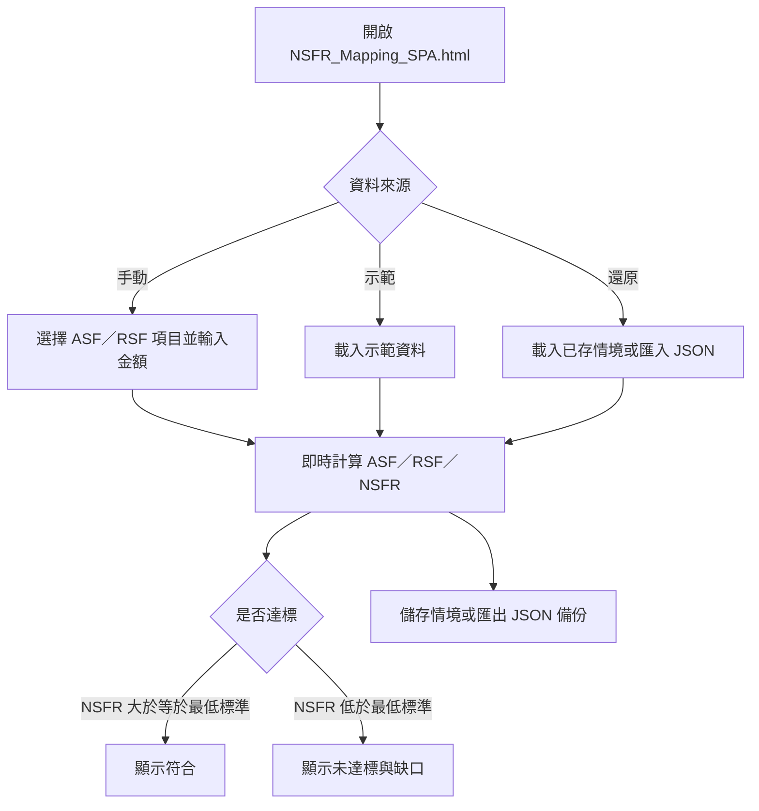
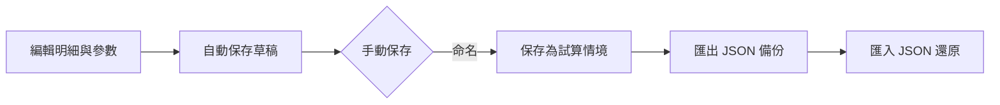

# NSFR 淨穩定資金比率試算工具

`NSFR_Mapping_SPA.html` 是一個在瀏覽器本機執行的臺灣「淨穩定資金比率」（Net Stable Funding Ratio, NSFR）係數查詢與試算工具。它把金管會「淨穩定資金比率之計算方法說明及表格」中的可用穩定資金（ASF）與應有穩定資金（RSF）項目與係數整理成可搜尋的對照表，並讓使用者逐筆輸入帳面金額，即時計算 NSFR。

工具為單一靜態 HTML 檔，內含全部 CSS 與 JavaScript，不依賴任何 CDN 或外部函式庫，可直接以 `file://` 離線開啟。所有資料只在目前瀏覽器本機處理，不會上傳。

## 快速開始

1. 以任一現代瀏覽器開啟 `NSFR_Mapping_SPA.html`。
2. 在「試算」頁，用「加入明細」下拉選單選擇 ASF 或 RSF 項目，輸入帳面金額後按「加入明細」；係數會自動帶入。
3. 明細表中的金額可直接修改，上方「計算結果」會即時重算 ASF、RSF、NSFR 與資金缺口。
4. 需要示範時可按「載入示範資料」；「清空明細」只清除目前頁面的明細。

## 介面與操作

頁面分成四個分頁：

### 試算

- **計算結果**：顯示可用穩定資金（ASF）、應有穩定資金（RSF）、淨穩定資金比率（NSFR）與資金缺口（ASF － RSF），並依參數頁設定顯示符合／警示／未達標訊息，下方同步列出計算過程。
- **加入明細**：下拉選單分成 ASF 與 RSF 兩組，選取後自動帶入係數；輸入金額後按「加入明細」。
- **明細清單**：列出代碼、方向、項目、大類、帳面金額、係數與加權金額，可逐筆修改金額或刪除。
- **試算情境**：將目前明細命名後儲存於瀏覽器本機，可載入、刪除，或以 JSON 匯出／匯入備份。

### Mapping 表

列出全部 ASF（13 項）與 RSF（27 項）係數，可用關鍵字搜尋項目、大類或判斷條件，並依方向（ASF／RSF）與大類篩選。

### 參數

- **NSFR 最低標準**：預設 100%。依「銀行淨穩定資金比率實施標準」，銀行計算之 NSFR 不得低於 100%。
- **內部警示門檻**：預設 110%，僅為工具內部提醒；NSFR 低於此門檻時結果區會顯示警示。

參數會保存於瀏覽器本機，重新開啟頁面後自動帶回。

### 使用說明

列出計算公式、使用方式與重要限制，並註明係數表依據來源。

## 資料保存與匯出

- **儲存方式**：瀏覽器支援時，資料以 **IndexedDB** 保存（資料庫名稱 `nsfr-mapping-calc`）；不支援時改用 `localStorage`；兩者皆不可用時（例如部分 `file://` 限制）僅保留於目前頁面。
- **保存內容**：目前編輯中的明細（草稿）、參數設定，以及使用者命名的試算情境。
- **自動保存**：明細與參數變更後約 0.5 秒自動保存草稿。
- **匯出備份**：按「匯出備份（JSON）」會下載包含參數、目前明細與所有情境的 `nsfr_backup_YYYYMMDDHHmmss.json`。
- **匯入備份**：按「匯入備份（JSON）」選取先前匯出的檔案；若備份含情境，會詢問要**合併**（保留現有並新增）或**覆寫**（清除現有後還原）。
- 換瀏覽器、使用無痕視窗或清除網站資料後，本機保存的資料可能無法取得；建議定期匯出 JSON 備份。

## 侷限與注意

- 本工具是 NSFR 係數對照與試算輔助，**不取代**主管機關完整條文、附錄及申報表格。
- 複合性或具選擇權之商品，仍須依交易對手、剩餘期間、擔保品、風險權數、受限制狀態及是否重複列計逐案判斷；同一項目符合兩個以上類別時，應適用較高係數且不得重複計算。
- 表外暴險、衍生性商品淨額與相互依存項目之計算較複雜，正式申報前請回歸主管機關規定及計算表逐項核對。
- 係數表依金管會民國 105 年 12 月 26 日金管銀法字第 10510005801 號令訂定之版本整理；使用前請確認主管機關是否另有更新函令。
- 示範資料僅為操作示意，非任何實際機構資料。

## 常見問題

### 畫面樣式異常或按鈕沒有作用

本工具為純離線單檔，不使用外部 CDN。若仍異常，請確認瀏覽器為現代版本（Chrome、Edge、Firefox、Safari），或改用靜態檔案伺服器開啟。

### 重新開啟後資料不見了

請確認使用同一瀏覽器、同一種一般視窗，且未清除網站資料。若環境不支援持久化（狀態列會提示），請改用「匯出備份（JSON）」保存。

### NSFR 結果與預期不同

檢查 ASF／RSF 各項目是否歸類正確、係數是否適用，以及金額是否為基準日帳面金額；必要時回到「Mapping 表」核對判斷條件與剩餘期間。

### 情境載入後覆蓋了目前明細

載入情境前會先確認；若誤覆蓋，可從匯出備份還原，或重新加入明細。

## 維護者檢查

本工具是單一靜態 HTML 檔案，沒有 `package.json`、建置流程或測試腳本。修改後可直接以瀏覽器開啟 `NSFR_Mapping_SPA.html`，實際走過：加入 ASF／RSF 明細並確認即時重算、切換四個分頁、使用 Mapping 表搜尋與篩選、儲存／載入／刪除情境、匯出後再匯入 JSON，以及重新整理後草稿與參數是否保留。

係數表資料位於檔案內的 `MAP` 陣列，示範資料位於 `DEMO` 陣列；更新係數或項目時，請同步核對金管會現行規定。
