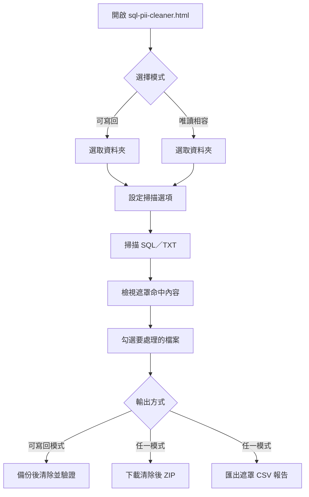
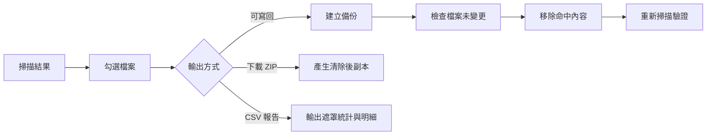

# SQL 個資清除工具

`sql-pii-cleaner.html` 是一個在瀏覽器本機執行的 SQL／TXT 個資掃描與清除工具。它會遞迴讀取指定資料夾中的 `.sql`、`.txt` 檔案，偵測常見個資格式，先以遮罩方式顯示命中內容，再由使用者選擇要清除的檔案。

所有檔案內容都在目前瀏覽器中處理，不需要安裝後端服務，也不會上傳到外部網站。

## 快速開始

1. 使用新版 Microsoft Edge 或 Google Chrome 開啟 `sql-pii-cleaner.html`。
2. 選擇掃描方式：
   - **選取資料夾並可寫回**：使用瀏覽器的資料夾存取權限，掃描後可直接寫回原檔。建議使用 Edge／Chrome，並在瀏覽器要求權限時允許存取。
   - **唯讀相容模式**：以檔案選擇器讀取資料夾內容，不會修改原始檔案；清除後請使用 ZIP 下載結果。
3. 確認掃描選項與排除規則後，等待掃描完成。
4. 點選表格中的檔案檢視命中位置；確認無誤後勾選要處理的檔案。
5. 依需求選擇：
   - 可寫回模式：按 **清除勾選檔案並寫回**。
   - 任一模式：按 **下載清除後 ZIP**，另存清除後檔案。
   - 需要紀錄時：按 **匯出報告（CSV）**。

## 掃描內容

工具預設啟用以下偵測項目：

- **身分證字號**：依格式與檢查碼判斷，可選擇是否接受第二碼 `8`、`9`，以及是否忽略大小寫。
- **帳號**：偵測 12～14 位數字；符合 14 位時間格式時，依選項排除。
- **彙整序號**：偵測以 `61` 或 `62` 開頭的 15 位數字。
- **彙整子號**：偵測以 `6` 加英文字母開頭的 15 碼值。
- **統編**：依 8 位格式與檢查碼判斷；符合日期格式 `yyyyMMdd` 時，依選項排除。

偵測結果會顯示檔案路徑、檔案類型、編碼、各類型命中筆數與警告狀態。點選檔案後，右側會顯示最多 200 個命中行的前後文；個資值只以部分遮罩呈現，不會在畫面中完整顯示。

## 掃描選項

- **身分證檢查碼**：啟用後只保留通過身分證檢查碼的結果。
- **含第二碼 8／9**：擴大身分證第二碼的偵測範圍。
- **忽略大小寫**：也偵測小寫英文字母。
- **排除 14 位時間**：避免把 `yyyyMMddHHmmss` 誤判為帳號。
- **彙整序號、彙整子號、統編**：分別控制對應格式的偵測。
- **統編檢查碼**：啟用後只保留通過統編檢查碼的結果。
- **排除 8 位日期**：避免把 `yyyyMMdd` 誤判為統編。
- **排除資料夾或檔案名稱**：以逗號分隔，可使用 `*` 萬用字元；預設留白。例如：`_backup_*,.git`。

表格欄位可以點選排序。若自動判斷編碼不確定，可在「編碼」欄位改選 UTF-8、Big5、GB18030、UTF-16LE 或 UTF-16BE，工具會立即重新掃描該檔案。

## 清除與輸出

### 直接清除並寫回

此功能只在「選取資料夾並可寫回」模式可用。

1. 勾選含有命中的檔案。
2. 建議保留「寫回前備份」選項。
3. 按 **清除勾選檔案並寫回**，閱讀確認訊息後再確認。
4. 工具會在寫回前檢查檔案是否已被其他程式修改；若檔案內容已變更，該檔案會跳過並要求重新掃描。
5. 寫回後會重新掃描，並在紀錄區顯示成功、失敗或仍有命中的檔案。

清除動作是直接移除命中的位元組，**不是以固定字元取代**。若命中值沒有被單引號或雙引號包住，工具會顯示警告；直接移除後可能造成 SQL 語法錯誤，請務必先確認內容並保留備份。

啟用備份時，原始檔案會保存在來源資料夾下的 `_backup_YYYYMMDDHHmmss` 目錄，並保留原本的子目錄結構。若停用備份，清除後無法由工具復原。

### 下載清除後 ZIP

此功能適用於可寫回與唯讀模式。工具會將勾選檔案的命中內容移除，產生 `sql_cleaned_YYYYMMDDHHmmss.zip`，並保留原本的相對路徑與檔案編碼。此操作不會修改來源檔案。

### 匯出 CSV 報告

按 **匯出報告（CSV）** 可產生 `sql_pii_report_YYYYMMDDHHmmss.csv`。報告包含檔案路徑、編碼、各類型命中數、未加引號筆數、處理狀態，以及「行號：類型：遮罩值」明細；明細中的個資值維持遮罩，不匯出完整值。

## 資料安全與限制

- 工具沒有伺服器端程式、資料庫或網路上傳流程；檔案由瀏覽器讀入記憶體後在本機掃描。
- 關閉頁面、重新整理或換瀏覽器後，這次載入的檔案清單與掃描結果不會保留，請重新選取資料夾。
- 可寫回模式需要瀏覽器支援 `showDirectoryPicker`。若瀏覽器不支援，請改用唯讀相容模式。
- 大量檔案或大型檔案會占用瀏覽器記憶體；建議分批處理，並在清除前確認磁碟仍有足夠空間保存備份與 ZIP。
- 自動編碼判斷並非所有檔案都能百分之百確認；看到「編碼待確認」時，請手動指定編碼後重新掃描。
- 清除不會自動修正 SQL 語法。未加引號命中、字串串接或特殊格式資料，應在備份或 ZIP 副本上自行驗證。

## 常見問題

### 按鈕無法直接寫回資料夾

請改用新版 Edge／Chrome，或按 **選取資料夾（唯讀相容模式）**。唯讀模式不能使用直接寫回，但仍可下載清除後 ZIP。

### 掃描結果太多或太少

檢查身分證、帳號、彙整序號、彙整子號、統編等選項，以及日期／時間排除選項。若檔案編碼顯示待確認，先從表格的編碼下拉選單指定正確編碼，再重新掃描。

### 清除後仍顯示命中

工具會在寫回後重新掃描；剩餘命中可能是清除後重新組成的數字字串。請查看紀錄區與右側明細，必要時重新檢查相關 SQL。

### 找不到某些檔案

工具只掃描副檔名為 `.sql` 或 `.txt` 的檔案；也請檢查排除規則是否排除了包含該檔案的資料夾。

## 維護者檢查

本專案目前是單一靜態 HTML 檔案，沒有 `package.json`、建置流程或測試腳本。修改後可直接以瀏覽器開啟 `sql-pii-cleaner.html`，實際走過可寫回／唯讀模式、重新掃描、ZIP 下載與 CSV 匯出流程進行人工驗證。

目前未執行自動化測試；本 README 的操作說明是依 `sql-pii-cleaner.html` 現有程式行為整理。
